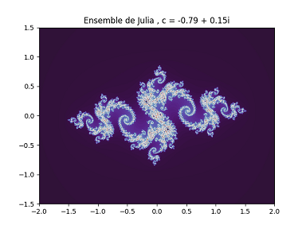
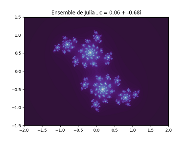

## Modélisation numérique de l'application logistique et des fractales associées

Des programmes codés en Python pour modéliser l'application logistique, son diagramme de bifurcation et les différentes fractales qui lui sont associées (l'ensemble de Mandelbrot et les ensembles de Julia). Codé avec mon ami Valentin Rollo.

### Aperçu

  
  
  
  

  
  

### Théorie

*Voir le compte-rendu [ici](https://github.com/nathanzimniak/logistic-map/blob/main/compte-rendu.pdf).*
