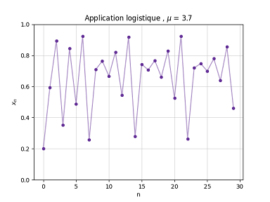
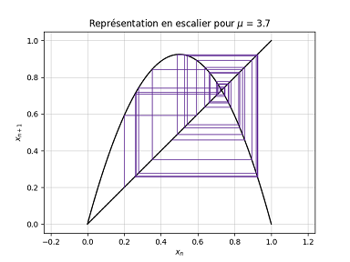
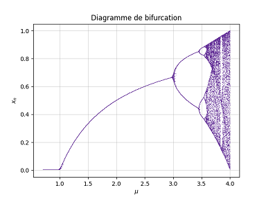
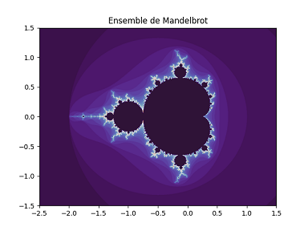
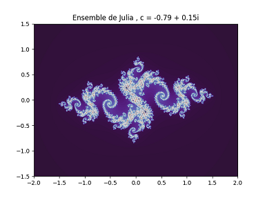

## Modélisation numérique de l'application logistique et des fractales associées

 

Des programmes codés en Python pour modéliser l'application logistique, son diagramme de bifurcation et les différentes fractales qui lui sont associées (l'ensemble de Mandelbrot et les ensembles de Julia).

### Aperçu

  
  
  

  
  

### Théorie

En construction

### Bibliographie

F. Faure. *Cours systèmes dynamiques, chaos et applications*. 2018.

D. Muller (Veritasium). *This equation will change how you see the world*. 2020.

J. Cottanceau (El Jj). *Deux (deux ?) minutes pour Mandelbrot*. 2015.

O. Ushakova. *Introduction à l'étude dynamique des polynômes complexes*. 2015.

A. Chéritat. *Une balade parmis les ensembles de Julia*. 2016.
